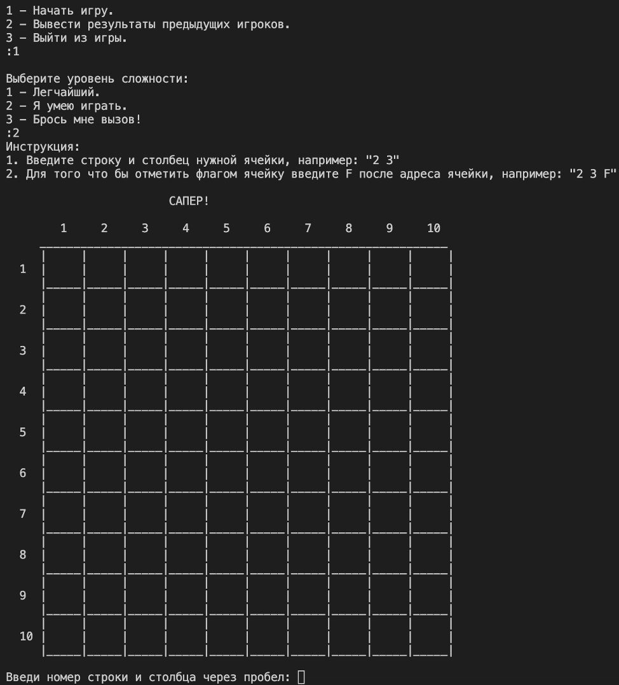

# Сапёр

Привет! Это консольная игра "Сапёр" на Python. Для игры необходимо вводить координаты ячеек и отмечать флагами потенциальные мины. Игра продолжается до тех пор, пока не найдены все безопасные ячейки или пока не попадёшь на мину.

## Инструкция

1. Запустите игру, выбрав соответствующий пункт меню.
2. Выберите уровень сложности: легкий, средний или сложный.
3. Введите координаты ячейки, чтобы открыть её содержимое.
4. Для отметки флагом ячейки добавьте символ `F` после координаты (например, `2 3 F`).
5. Продолжайте открывать ячейки и отмечать флагами, пока не завершите игру.

## Функциональность

- Генерация случайного расположения мин на поле.
- Вычисление числа мин вокруг каждой ячейки.
- Рекурсивное открытие соседних ячеек с нулевым значением.
- Отображение текущего состояния игрового поля.
- Проверка окончания игры при открытии всех безопасных ячеек.

## Запуск игры

1. Установите Python (версия 3.x).
2. Скопируйте код из файла `minesweeper.py` или сам файл.
3. Запустите скрипт в командной строке или в среде разработки Python.

## Зависимости

Для запуска игры необходимы следующие пакеты Python:

- `random`
- `os`
- `time`

## Уровни сложности

- **Легчайший**: поле 5x5, 2 мины.
- **Я умею играть**: поле 10x10, 10 мин.
- **Брось мне вызов**: поле 15x15, 30 мин.

## Результаты игры

Результаты игры сохраняются в файле `results.txt`. Вы можете просмотреть результаты предыдущих игроков в меню игры.

## Скриншот из игры

---

**Примечание**: Код игры представлен на языке Python.

